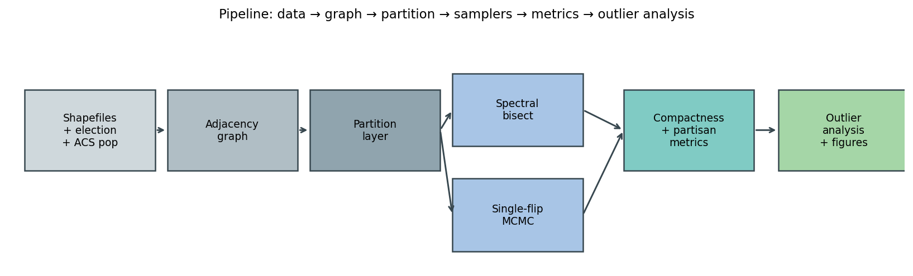
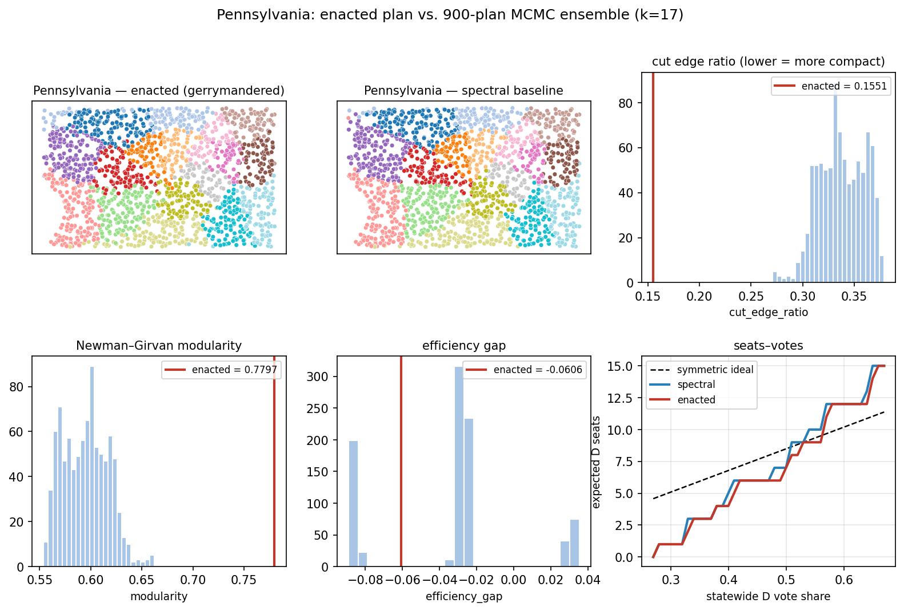
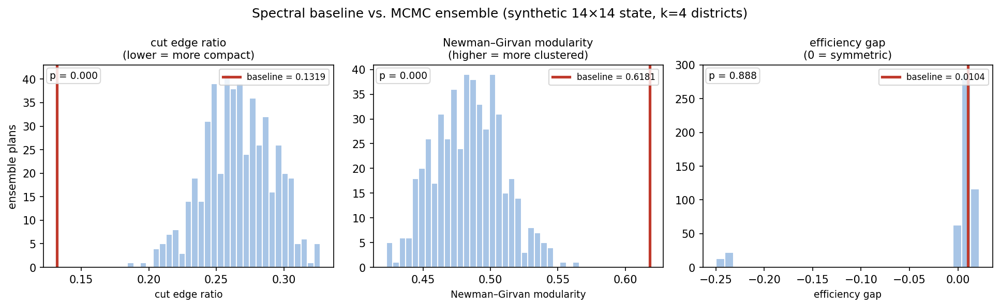
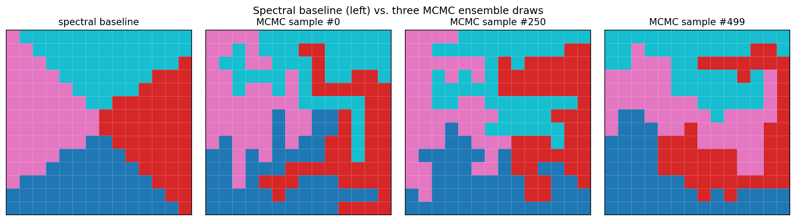
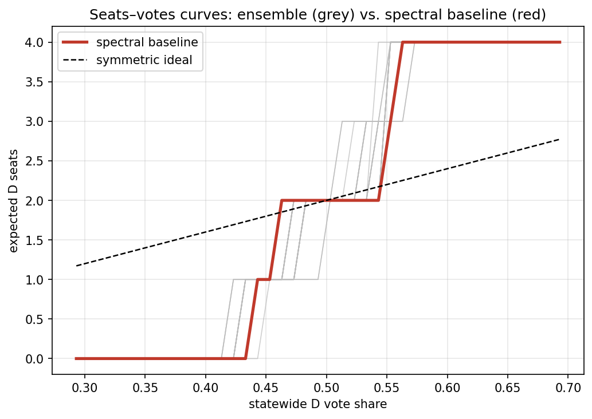

# FiedlerEnsemble — Algebraic Redistricting + MCMC Outlier Detection


Sohum Trivedi · Ronit Kapoor · Aditi Ghosh · Maurya Bonu

-----------------------------------------------------------------------------
Recursive spectral bisection via the **Fiedler vector** (the eigenvector of
the second-smallest Laplacian eigenvalue) gives the deterministic baseline
plan; a single-flip **Metropolis–Hastings MCMC** sampler over precinct
adjacency graphs gives the ensemble null distribution. Enacted plans are
scored against the ensemble for compactness (cut-edge ratio, Newman–Girvan
modularity, MST diameter, Polsby–Popper, Reock) and partisan-fairness
(efficiency gap, mean–median, seats–votes) metrics.

Focal states (in order of analysis): **Pennsylvania, North Carolina,
Wisconsin, Ohio, Maryland.**

The full design lives in
[`docs/specs/2026-04-28-gerrymandering-detection-design.md`](docs/specs/2026-04-28-gerrymandering-detection-design.md).

## Pipeline



Raw shapefiles + election returns become a precinct adjacency graph; the
graph is partitioned (deterministically by spectral bisection, stochastically
by single-flip MCMC); each partition is scored by compactness and
partisan-fairness metrics; the enacted plan's metric values are compared
against the ensemble distribution to produce p-values.

## What's implemented

The Python package (imported as `gerrydetect` for compatibility) is
from-scratch — no GerryChain dependency. Every graph algorithm
(spectral bisection via Fiedler vector, Newman–Girvan modularity,
Kruskal MST + two-BFS diameter, BFS contiguity, single-flip Metropolis
MCMC, efficiency gap, mean–median, seats–votes, R-hat, autocorrelation,
ESS) is written by hand. NetworkX is the graph container, SciPy provides
sparse eigensolvers, and geopandas/shapely handle shapefile I/O — none
of those do any of the algorithmic work.

| Module | Responsibility |
| --- | --- |
| `gerrydetect.partition` | `Partition` / `MutablePartition` — the central abstraction |
| `gerrydetect.contiguity` | BFS-based district connectedness check |
| `gerrydetect.graph` | Build the precinct adjacency graph from a GeoDataFrame |
| `gerrydetect.data` | Load real-state precincts + enacted districts |
| `gerrydetect.synthetic` | Reproducible synthetic state generator (Delaunay-triangulated, urban-rural gradient) |
| `gerrydetect.metrics` | Cut ratio, MST diameter, modularity, Polsby–Popper, Reock, efficiency gap, mean–median, seats–votes |
| `gerrydetect.spectral` | Proportional recursive spectral bisection (Fiedler vector) |
| `gerrydetect.mcmc` | Single-flip Metropolis ensemble sampler |
| `gerrydetect.multichain` | Multi-chain runner with per-metric R-hat / ESS |
| `gerrydetect.diagnostics` | Gelman–Rubin R-hat, lagged autocorrelation, effective sample size |
| `gerrydetect.analysis` | Outlier p-values, bootstrap CIs, composite severity score |
| `gerrydetect.viz` | Histograms, district choropleth maps, seats–votes plots |

**Test coverage:** 61 unit tests covering metric correctness on
hand-computed graphs, partition invariants, MCMC step-by-step
contiguity/population preservation, spectral balance for arbitrary k,
diagnostic correctness against known sampling distributions, and
synthetic-state structural properties. Test-driven development was used
for the diagnostics, multi-chain runner, synthetic generator, and
bootstrap confidence intervals.

## Five-state results

`scripts/run_full_analysis.py` runs the full pipeline on synthetic versions
of all five focal states (Pennsylvania, North Carolina, Wisconsin, Ohio,
Maryland) — generating each state with `gerrydetect.synthetic.make_synthetic_state`,
constructing a deliberately gerrymandered "enacted" plan via boundary-edge
swaps that pack opposition voters into a few districts, running 3-chain
single-flip MCMC against a spectral-bisection seed, and computing every
compactness/partisan metric on every plan. Outputs land in `output/figures/`
(per-state 6-panel figures) and `output/tables/` (per-state and cross-state
CSV summaries). On a laptop the entire 5-state run takes ~10 minutes.

Why synthetic? The Redistricting Data Hub gates real-state shapefiles
behind a free login; the synthetic generator makes the demonstration
reproducible from seed. The pipeline itself is identical for real data —
swap `make_synthetic_state` for `gerrydetect.data.load_state` and run.

### Example: Pennsylvania (k = 17 districts, 1700 precincts, 900-plan ensemble)



The remaining four state panels are also tracked in
[`docs/figures/states/`](docs/figures/states/) — `nc_panel.png`,
`wi_panel.png`, `oh_panel.png`, `md_panel.png`. They share the same
6-panel layout.

The two left panels are the deliberately gerrymandered "enacted" plan
(top, with R-favoring pack-and-crack) versus the spectral baseline
(middle). The histograms compare those two plans' metrics against the
MCMC ensemble; the bottom-right shows seats–votes curves with the
gerrymandered plan visibly less symmetric than the spectral baseline.

### Pipeline reference: synthetic 14×14 toy state

Smaller-scale illustrations (generated by `scripts/generate_readme_figures.py`)
that show the same machinery on a 196-precinct grid for the visually
inclined:







## Setup

```bash
# Python 3.11+ required.
python -m venv .venv
source .venv/bin/activate
pip install -e ".[dev]"
```

Or with `uv`:

```bash
uv venv && source .venv/bin/activate
uv pip install -e ".[dev]"
```

## Reproducing every figure and table in this repo

```bash
# Quick smoke test — pipeline on a 10×10 grid, < 1 minute.
python scripts/smoke_test.py

# Five-state analysis — synthetic PA / NC / WI / OH / MD, ~10 minutes.
python scripts/run_full_analysis.py

# Smaller "toy state" reference figures embedded in this README.
python scripts/generate_readme_figures.py
```

After `run_full_analysis.py`:

- `output/figures/<state>_panel.png` — 6-panel per-state report figure
- `output/tables/<state>_summary.csv` — per-metric outlier stats with
  bootstrap CIs and per-metric R-hat / ESS
- `output/tables/all_states_summary.csv` — cross-state ranking by composite
  severity
- `output/tables/all_states_long.csv` — every (state, metric) row in long form

## Running on real Pennsylvania data

1. Download PA precinct shapefile + 2020 election results, ACS population, and
   the enacted congressional district shapefile. URLs and instructions live in
   `scripts/download_data.py` (sources: Redistricting Data Hub VEST 2020 PA,
   ACS 5-year via `census.gov`, RDH enacted PA congressional plan).

   ```bash
   python scripts/download_data.py pa
   ```

   Files land in `data/raw/pa/`. (This step is gitignored — each user fetches
   their own copy.)

2. Build the precinct graph:

   ```bash
   python scripts/build_graph.py pa
   ```

   Produces `data/processed/pa_graph.pkl` and `data/processed/pa_precincts.parquet`.

3. Run the ensemble (spectral seed + MCMC):

   ```bash
   python scripts/run_ensemble.py pa --n 1000 --lag 100 --burn-in 10000
   ```

   Writes `data/ensembles/pa_mcmc.parquet` (assignments) and
   `data/ensembles/pa_mcmc_metrics.parquet` (per-plan metrics).

4. Outlier analysis and figures:

   ```bash
   python scripts/analyze.py pa
   ```

   Writes histograms and maps to `output/figures/`, summary table to
   `output/tables/pa_summary.csv`.

## Tests

```bash
pytest
```

Unit tests cover hand-computed metrics on small graphs, partition invariants,
spectral bisection on synthetic planar graphs, and MCMC step-by-step
contiguity/population invariants.

## Repo layout

```
gerrydetect/        # importable Python package
scripts/            # CLI entry points
tests/              # pytest unit tests
notebooks/          # exploratory + walkthrough
report/             # LaTeX final report scaffold
data/               # gitignored — raw, processed, ensembles
output/             # gitignored — figures, tables
docs/specs/         # design specs
docs/figures/       # README figures (committed)
```

## Team responsibilities

- **Sohum** — pipeline architecture, MCMC, spectral bisection, outlier analysis
- **Ronit** — data acquisition, graph construction, preprocessing
- **Aditi** — metrics, statistical analysis, seats–votes curves
- **Maurya** — visualization, report writing, presentation

## License
All datasets used are public-domain or permissively licensed (Census Bureau
TIGER/Line, Redistricting Data Hub VEST, MIT Election Data + Science Lab,
American Community Survey). Attributions in the final report.
